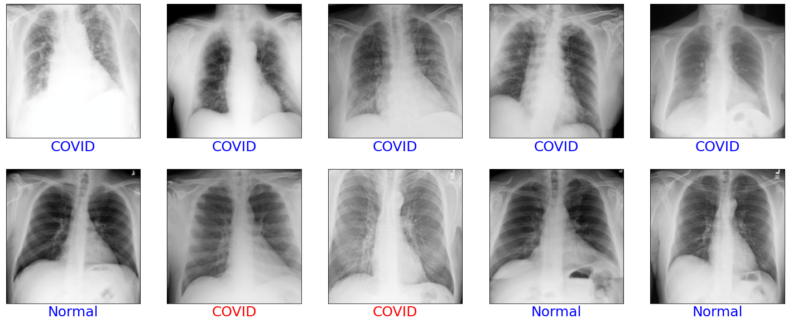

کد مربوطه به مقاله ارسالی به مجله مهندسی پزشکی زیستی، با عنوان:

## ترکیب روش آسیب مغزی بهینه و منظم‌سازی تُنُک ‌ در کوچک‌سازی یک مدل یادگیری عمیق برای شناسایی کووید۱۹

# Pruning deep neural networks to make them fast and small
## Train a VGG16 model for COVID19 detection, compress the model with pruning the model using Optimal Brain Damage (OBD) and Regularization methods

M. Amintoosi, m.amintoosi at gmail.com

## Start Using Google Colab:

برای اجرای برنامه در گوگل کولب از لینک زیر استفاده کنید.
به لحاظ ماهیت تصادفی مقداردهی اولیه‌ی وزنهای شبکه‌های عصبی، روال آموزش شبکه، خصوصیات سرور تخصیص داده شده و ... نتایج در اجراهای مختلف مقداری متفاوت خواهد بود. یک اجرای کامل برنامه حدود ۷۰ دقیقه طول کشیده و نزدیک به ۲ گیگابایت داده و مدل دانلود یا تولید خواهد شد. هیچ داده‌ای روی دستگاه شما ذخیره نخواهد شد و همه عملیات روی سرورهای گوگل انجام می‌شود.

https://colab.research.google.com/github/mamintoosi/OBD-for-VGG-Pruning-COVID19/blob/master/main_prune.ipynb

پس از آموزش یا هرس مدل، نتیجه‌ی اجرای آن روی داده‌های تست و صحت
(Accuracy) 
آن نمایش داده شده است.
خروجی مدل روی ده تصویر تصادفی آزمون هم نشان داده شده است. تصاویر سطر اول، همه کووید۱۹ و تصاویر سطر دوم همه نرمال هستند. برچسب زیر هر تصویر، خروجی مدل را مشخص می‌کند. اگر خروجی مدل با مقدار درست مطابقت داشته باشد، برچسب با رنگ آبی و درغیر اینصورت با رنگ قرمز نمایش داده شده است. با توجه به اینکه ده تصویر از ۲۰۰ تصویر به صورت تصادفی انتخاب شده‌اند،‌ ممکن است نتیجه‌ی این ده تصویر با مقدار صحت نمایش داده شده -که بر روی ۲۰۰ تصویر بوده است- یکی نباشد.

